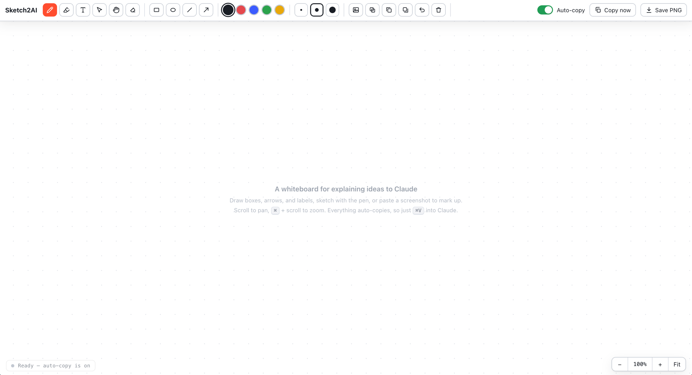

# Sketch2AI

A tiny drawing board that copies whatever you make straight to your clipboard, so you can paste it into Claude (or any chat that accepts images) and explain what you mean with a picture instead of words.

Sometimes it is faster to draw a box with an arrow than to describe it in a paragraph. That is the whole idea.

Try it here: https://hz47.github.io/Sketch2AI/

<p align="center">
  
</p>

## What it does

- Draw boxes, ellipses, lines, and arrows for flows and diagrams. Hold Shift to snap to squares, circles, and clean angles.
- Double-click a box or ellipse to type a label inside it, so a shape becomes a named component.
- Draw freehand with a pen, or use the highlighter to circle and emphasize parts of a screenshot.
- Paste a screenshot or copied text right onto the board with Cmd+V, and drag image files in from Finder.
- Move, resize, duplicate, and layer anything. Drag a box around several items to select them all at once.
- Work on an endless canvas. Scroll to pan, pinch or Cmd+scroll to zoom, and keep adding content wherever you like.
- Every time you change something, the visible area of the canvas is copied to your clipboard. Pan and zoom to frame what you want, and that is what gets copied. Then you paste it into Claude.

It is meant to sit next to the text you write to Claude: draw the thing, paste the picture, and let the words and the sketch explain the idea together.

There is also a "Copy now" button if you turn off auto-copy, and a "Save PNG" button that downloads the board as a file.

## How to use it

1. Open `index.html` in Chrome (double-click the file, or right-click and choose Open With, then Google Chrome).
2. Draw something.
3. Switch to Claude and press Cmd+V.

That is it. No install, no account, no server. It is one HTML file with everything inside it.

### Make it feel like a real app (optional)

Open the page in Chrome, then go to the menu and pick "Install page as app" (older Chrome calls it "Create Shortcut" with the "Open as window" option). You get a dock icon and its own window.

## Use it with Claude Code in the terminal (macOS)

There is a `/sketch` command for Claude Code. Type `/sketch` in your terminal, the whiteboard opens, you draw, and pressing Cmd+Return sends the drawing straight into your Claude Code session. Focus then jumps back to your terminal, so it is one keypress to send and no clicks to return.

Under the hood it runs `tools/sketch-bridge.py`, a small standard-library server that hosts the board on `127.0.0.1`, catches the drawing you send, saves it as a PNG, and prints the file path for Claude to read. Because the board is served by that same local server, the "Send to Claude" button posts the image back to it with no clipboard or cross-origin hurdles. The button only appears when the page is opened with `?bridge=1`, so the hosted site above is unchanged.

**This only works with Claude Code running locally on a Mac.** It opens a browser on your machine for you to draw in, so it cannot run in a remote or cloud Claude Code session (there is no local browser, and no one is sitting at that machine to draw), and it is macOS only. If it is ever launched somewhere it cannot work, it exits right away with a message instead of hanging.

### Setup

1. Clone this repo somewhere on your Mac.
2. Create the command file `~/.claude/commands/sketch.md` (global, so `/sketch` works in any session). Put this inside it, replacing the path with wherever you cloned the repo:

   ```markdown
   ---
   description: Open the Sketch2AI whiteboard, draw, and pull the drawing into this session
   ---

   The user wants to draw something and hand the drawing to you. Use the
   Sketch2AI bridge to capture it.

   1. Run the bridge in the foreground and wait for it to finish (it blocks until
      the user sends a drawing, so pass a Bash `timeout` of 600000 ms):

      `uv run python3 /ABSOLUTE/PATH/TO/Sketch2AI/tools/sketch-bridge.py`

      It opens the whiteboard in the browser and prints the path to a PNG as its
      last stdout line on success.
   2. If it exits non-zero, tell the user the sketch was not captured and stop.
   3. On success, Read the PNG path from the last stdout line so you can see the
      drawing, then act on whatever the user asked. If they gave no other
      instruction, briefly say what you see and ask what they want done with it.

   $ARGUMENTS
   ```

   Use `python3` instead of `uv run python3` if you do not use uv. You can also
   put the file in a project's `.claude/commands/` instead of the global folder,
   in which case `/sketch` is available only when you run Claude Code in that
   project.

3. The first time you run `/sketch`, macOS may ask to let your terminal control
   System Events (used to bring the terminal back to the front). Allow it once.

### Let Claude draw a diagram for you (`/sketch-diagram`)

The reverse direction also works: describe a diagram and Claude draws it onto the
board as real, editable shapes. Say `/sketch-diagram the login flow` and boxes,
arrows, and labels appear on your canvas, laid out automatically. Every element is
an ordinary Sketch2AI shape, so you can drag, relabel, restyle, or delete any of
it, and mix it with your own drawing.

It uses `tools/sketch-diagram-bridge.py`, which lays out a node/edge graph in
Python and injects it through the same `?bridge`-style gate (`?diagram=1`). Same
requirement as above: local Mac only. Set it up with a `~/.claude/commands/sketch-diagram.md`
command that runs the bridge with a graph JSON file, the same way `/sketch` is wired.

## A note about the clipboard

The copy feature needs the page to run as a local file or a real website. If you open it inside a sandboxed preview, the browser blocks clipboard access and you will see a "Copy blocked" message. Running the local file in Chrome fixes it. If a copy is ever blocked, use the "Save PNG" button and drag the file in instead.

Pasting an image works in the Claude desktop app and on claude.ai. It does not work in the Claude Code terminal, which only takes text.

## Keyboard shortcuts

- `P` pen, `G` highlighter, `E` eraser
- `R` rectangle, `O` ellipse, `L` line, `A` arrow
- `T` text, `M` move and select
- `H` pan (or hold Space and drag, or drag with the middle mouse button)
- `1` fit everything in view
- `Cmd +` / `Cmd -` / `Cmd 0` zoom in, out, reset to 100%
- `Cmd+D` duplicate the selection
- `Cmd+]` / `Cmd+[` bring to front, send to back
- `Cmd+Z` undo the last thing you added
- `Cmd+C` copy the drawing now
- `Cmd+V` paste an image or text onto the canvas
- `Delete` remove the selected items

## Built with

Plain HTML, CSS, and JavaScript. No libraries, no build step. The drawing runs on an HTML canvas.

## License

MIT. Do whatever you like with it.
